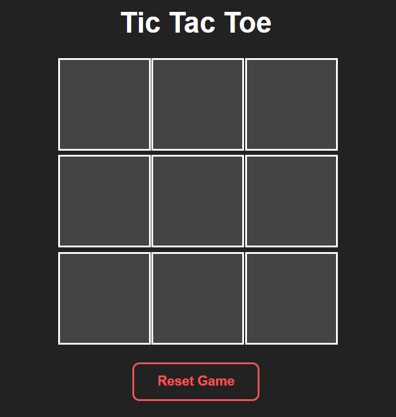
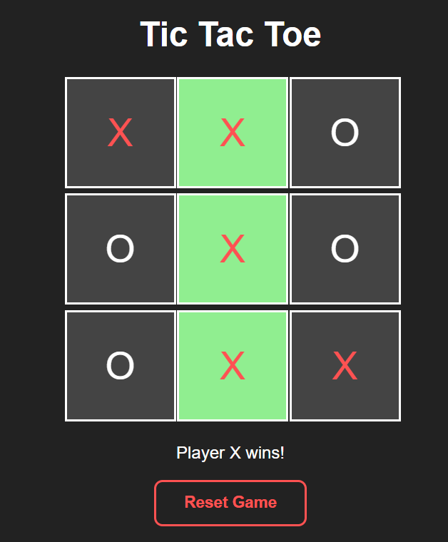
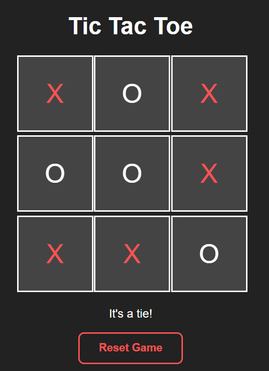

# ❌⭕ Tic Tac Toe

A classic two-player Tic Tac Toe game built with HTML, CSS, and JavaScript — playable right in the browser, no installations needed!

---

## 📸 Screenshots

<p align="center">
  
  
  
</p>

---

## 🚀 Features

- 🎮 Two-player turn-based gameplay (X and O)
- 🏆 Detects winner and highlights the winning cells in green
- 🤝 Detects a tie when all 9 cells are filled
- 🔄 Reset button to restart the game at any time
- 📱 Responsive design for all screen sizes

---

## 🛠️ Built With

| Technology | Usage |
|------------|-------|
| HTML5 | Game board structure & layout |
| CSS3 | Styling & responsiveness |
| JavaScript (Vanilla) | Game logic & DOM manipulation |

---

## 📂 Project Structure

```
tic-tac-toe/
├── index.html        # Game layout and board (3×3 grid of cells)
├── style.css         # Styling
├── script.js         # Game logic (win detection, turns, reset)
└── screenshots/
    ├── tic-tac-toe.png   # Game board
    ├── playerwins.png    # Win screen
    └── tie.png           # Tie screen
```

---

## ⚙️ Getting Started

1. **Clone the repository**
   ```bash
   git clone https://github.com/NainaKothari-14/tic-tac-toe.git
   ```

2. **Navigate into the project folder**
   ```bash
   cd tic-tac-toe
   ```

3. **Open `index.html` in your browser**  
   Just double-click the file — no server or installation needed!

---

## 🎮 How to Play

1. The game is played on a **3×3 grid**
2. Player **X** always goes first, followed by Player **O**
3. Players take turns clicking an empty cell to place their mark
4. The first player to get **3 in a row** — horizontally, vertically, or diagonally — wins
5. The winning cells are **highlighted in green** 🟩
6. If all 9 cells are filled with no winner, the game ends in a **tie**
7. Click **Reset Game** to start a new round

---

## 🧠 Winning Combinations

The game checks all **8 possible winning lines**:

| Type | Combinations |
|------|-------------|
| Rows | [0,1,2] · [3,4,5] · [6,7,8] |
| Columns | [0,3,6] · [1,4,7] · [2,5,8] |
| Diagonals | [0,4,8] · [2,4,6] |

---

## 👩‍💻 Author

**Naina Kothari**  
GitHub: [@NainaKothari-14](https://github.com/NainaKothari-14)
